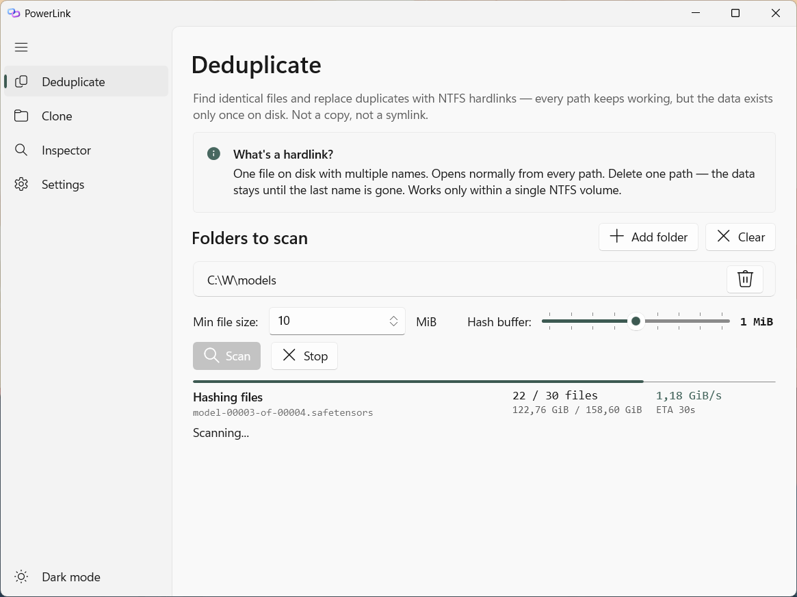
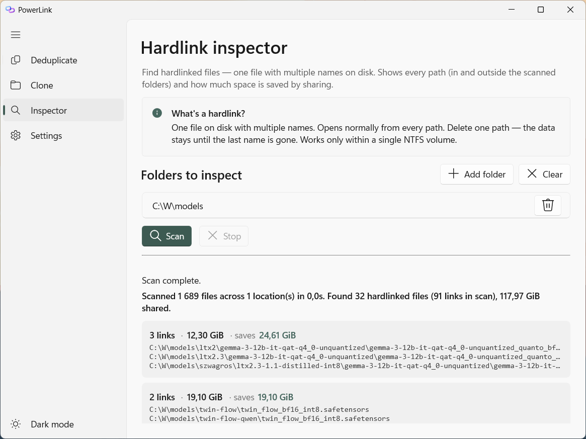
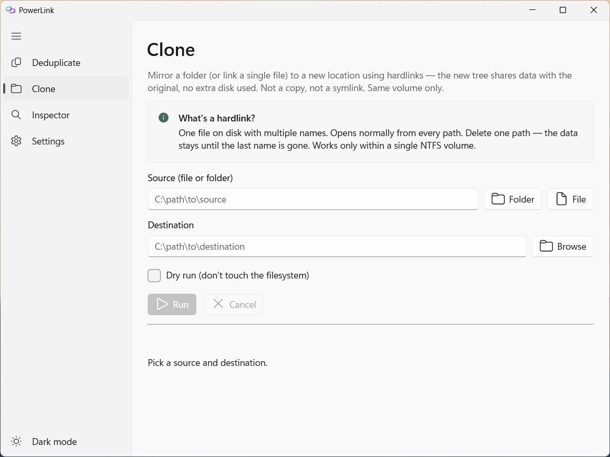
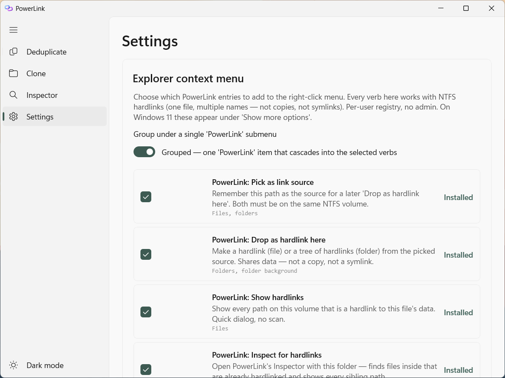
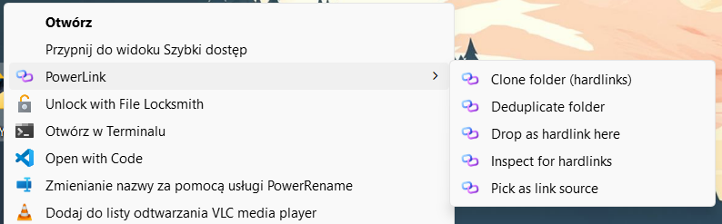
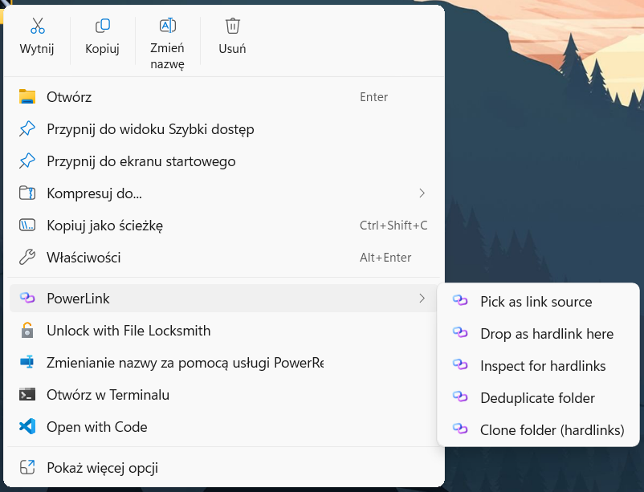
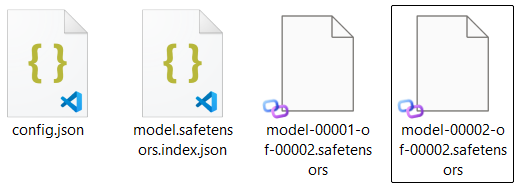

# PowerLink

NTFS hardlink tool for Windows — deduplicate identical files in place, clone directories without copying data, and drive it all from Explorer.

> **Status:** pre-release. Setup.exe + portable zip on the [Releases](../../releases) page, not code-signed yet. See [Limitations](#limitations) before installing.

---

## Why

I run a lot of AI models locally. Different pipelines pull in different checkpoints, but many of them ship with the **same supporting files** — text encoders, VAEs, CLIP weights, a dozen gigabytes each, copied verbatim across folders. Every time I downloaded a new model or assembled a custom setup, my disk usage grew by the size of the shared bits all over again, even though the bytes on disk were byte-for-byte identical.

Windows doesn't have a first-class answer for this. Symlinks need admin or Developer Mode to create; junctions only work on folders; copy-on-write is ReFS only. **NTFS hardlinks** do the job — the same bytes appear under many names, `File.Copy` stays transparent, tools that open the file don't care — but the ergonomics on Windows are miserable. `mklink /H` one file at a time from an admin `cmd` isn't a workflow.

I went looking for a tool and found an eight-year trail of PowerToys issues asking for exactly this — [#2527](https://github.com/microsoft/PowerToys/issues/2527), [#10047](https://github.com/microsoft/PowerToys/issues/10047), [#17887](https://github.com/microsoft/PowerToys/issues/17887), [#24571](https://github.com/microsoft/PowerToys/issues/24571), [#26607](https://github.com/microsoft/PowerToys/issues/26607), [#34247](https://github.com/microsoft/PowerToys/issues/34247). All closed as duplicates. None delivered. So I built it.

PowerLink starts narrow: point it at a folder of models, it finds the duplicates, replaces them with hardlinks, your disk shrinks, every pipeline keeps working. The same operations are wired into Explorer so normal copy/paste/drag workflows can use hardlinks too.

---

## What it does

**Deduplicate.** Scan one or more folders, find files with identical content, and replace duplicates with NTFS hardlinks. Both paths keep working; the data exists once. Typical use: an ML models directory where the same `.safetensors` sits under a dozen subfolders.

**Clone.** Mirror a directory tree — every file in the destination is a hardlink back to the source. Zero extra bytes. Same-volume only (NTFS hardlink constraint).

**Inspect.** Read-only scan that lists every hardlink group in a folder, including paths that point outside the scanned tree. Useful before you delete something you think is a "copy".

**Show links.** Given any file, enumerate every name on the volume that points at the same data. Catches forgotten hardlinks.

**Spot hardlinks at a glance.** An optional overlay handler draws a small badge on the icon of any file that's a hardlink (i.e. has more than one name on disk). Works like the OneDrive or Dropbox sync badges — you see it in every Explorer view without having to open a tool. Install is opt-in and admin-only because Windows reads overlay handlers from HKLM.

All of this is driven from a WinUI 3 app and a matching CLI. The shell extension plugs the same operations into Explorer — classic right-click menu, drag-and-drop handler, Windows 11 top-section menu, plus the overlay badge above.

---

## Screenshots

| Deduplicate | Hardlink Inspector |
|---|---|
|  |  |

| Clone | Settings |
|---|---|
|  |  |

**Explorer context menu** — classic right-click menu (under "Show more options" on Windows 11) on the left, Windows 11 modern top-section menu on the right. Both show the PowerLink submenu expanded:

| Classic | Windows 11 modern |
|---|---|
|  |  |

**Overlay badge** — the rightmost file is a hardlink and gets a small red arrow in the lower-left corner of its thumbnail, matching the shape Windows paints for shortcuts and junctions but recoloured so all three stay visually distinct:



---

## Download

Two flavors per tagged release on the [Releases](../../releases) page. Both bundle the .NET 8 runtime (no separate install needed) and both auto-update from inside Settings → Updates.

- **`PowerLink-win-Setup.exe`** — installer. Per-user install (no admin), Start Menu entry, Add/Remove Programs registration. ~80 MB.
- **`PowerLink-win-Portable.zip`** — extract anywhere, run `PowerLink.exe`. No registry footprint until you opt into shell integration. ~80 MB.

Both are produced by [Velopack](https://velopack.io) and share the same auto-update mechanism — the app checks GitHub Releases, downloads the new package, and restarts itself. Setup.exe and Portable.zip are interchangeable in everything except the install footprint.

> **Note:** Velopack-style binary deltas aren't being produced yet (the `vpk pack` step ships only `*-full.nupkg`), so each update downloads the full ~70 MB package rather than a small diff. Functionally fine, just not bandwidth-efficient. Tracked as a follow-up.

First run triggers Windows SmartScreen (the binaries aren't code-signed yet) — click **More info → Run anyway**.

Curated release notes for each version are in [CHANGELOG.md](CHANGELOG.md) and on each GitHub release page (the workflow extracts the matching section automatically).

## Quick start

1. Download Setup.exe (run it) **or** Portable.zip (extract anywhere, run `PowerLink.exe`).
2. Pick an operation:
   - **Deduplicate** — add folders, press Scan (F5), review groups, press "Replace duplicates with hardlinks".
   - **Clone** — pick source + destination, optionally Dry run, press Run.
   - **Inspect** — add folders, press Scan to see all existing hardlink groups.
3. Optional: open **Settings** and install shell integration (see [Explorer integration](#explorer-integration) below).

No background service, no registry writes until you opt into shell integration from Settings. Setup.exe registers itself in Add/Remove Programs (per-user, no admin); Portable.zip leaves no trace beyond the folder you extracted into.

---

## Explorer integration

All four extension surfaces are off by default. Each one is a separate checkbox in Settings; install only what you want.

**Classic context menu** (per-user, no admin). Adds up to six PowerLink verbs to the right-click menu. On Windows 11 they appear under "Show more options" unless you also install the modern menu below. Two layouts:
- **Flat** — each verb is its own top-level entry.
- **Grouped** — a single "PowerLink" cascading submenu; only verbs relevant to the current selection type appear inside.

Verbs: Pick as link source, Drop as hardlink here, Show hardlinks, Inspect for hardlinks, Deduplicate folder, Clone folder (hardlinks).

**Drag-and-drop handler** (per-user, no admin). Right-drag files/folders onto a folder, release: a popup offers "Hardlink here" (for files) and "Clone tree here" (for folders). Multi-selection and cross-volume errors are handled inline.

**Windows 11 modern menu** — _experimental_ (per-user, no admin, but **Developer Mode required**). Adds a "PowerLink" submenu to the top section of the Win11 right-click menu, so you don't need the "Show more options" click. Uses an unsigned sparse MSIX package; Developer Mode is what lets it register without a signing certificate.

**Overlay icon** (requires admin). Adds a small badge to every file that's a hardlink (`nNumberOfLinks > 1`). Registered in HKLM under Windows' 15-slot overlay limit — before install, PowerLink counts the existing handlers and warns you if adding one would exceed the limit. Priority is set low so OneDrive / Dropbox / Git overlays still win on files they also claim.

---

## CLI

`PowerLink.Cli.exe` ships next to the app. Every GUI operation has a CLI counterpart.

| Command | What it does |
|---|---|
| `scan <paths...> [--min-size N]` | Dry-run scan, prints duplicate groups and wasted bytes. |
| `dedup <paths...> [--min-size N] [--execute] [--verify-content]` | Scan, then (with `--execute`) replace duplicates with hardlinks. `--verify-content` re-hashes both files before each delete (paranoid mode; default is mtime-triggered re-hash only). |
| `clone <source> <dest> [--dry-run]` | Mirror a folder or link a single file into the destination. |
| `pick <path>` | Remember a path as the source for a later `drop`. |
| `drop <target>` | Materialize the picked source at `<target>` (file = one hardlink, folder = tree). |
| `show-links <file>` | List every path on the volume sharing this file's data. |
| `install-overlay <dll-path>` | Register the overlay handler in HKLM. **Admin required.** |
| `uninstall-overlay` | Remove the overlay handler. **Admin required.** |

Paths with spaces: quote them. Minimum file size for dedup defaults to 1 MiB. Progress goes to stderr so `dedup ... | tee log.txt` keeps the structured stdout report clean.

---

## Requirements

- **Windows 10 version 1809** (build 17763) or later — for the GUI app and CLI.
- **Windows 11 build 22000+** — for the modern top-section menu (Windows 10 lacks the API).
- **NTFS** — all hardlink operations. FAT/exFAT volumes are rejected with a friendly error.
- **x64 or ARM64** — ARM64 builds compile but are **untested** on real hardware. See [Limitations](#limitations).
- **.NET 8 runtime** — bundled in both Setup.exe and Portable.zip. Nothing to install separately.
- **Developer Mode** — only for the experimental modern menu, because the sparse MSIX package is unsigned.
- **Admin** — only for installing the overlay icon (HKLM write).

Same-volume constraint applies to every hardlink operation — NTFS hardlinks cannot cross volumes.

---

## Build from source

Prerequisites:
- Visual Studio 2022 with the **Desktop development with C++** workload (for the native shell extension) and the **.NET desktop development** workload.
- Windows App SDK / WinUI 3 project templates (included with the C++ + .NET workloads).

```powershell
git clone <repo-url>
cd PowerLink
dotnet build PowerLink.slnx -c Release
```

`PowerLink.App.csproj` drives the C++ shell extension build via MSBuild as a `BeforeBuild` step, so a single `dotnet build` produces the full set:

```
src/PowerLink.App/bin/x64/Release/net8.0-windows10.0.19041.0/
  PowerLink.App.exe
  PowerLink.Cli.exe
  PowerLink.ShellExt.dll
  Assets/Icon.ico
  ...
```

Run tests:

```powershell
# .NET tests (xUnit)
dotnet test tests/PowerLink.Core.Tests/PowerLink.Core.Tests.csproj

# Native shell-ext utility tests (small console exe — non-zero exit = fail)
msbuild tests/PowerLink.ShellExt.Tests/PowerLink.ShellExt.Tests.vcxproj -p:Configuration=Debug -p:Platform=x64
.\tests\PowerLink.ShellExt.Tests\x64\Debug\PowerLink.ShellExt.Tests.exe
```

Integration tests that load the native DLL skip silently if `PowerLink.ShellExt.dll` hasn't been built for the current configuration. The native test exe runs against extracted helpers in `ShellExtUtils.cpp` (FormatArgs, GetModuleDir, SafeDecrement, ClampedSkip) and is also wired into CI (`release.yml` runs it before any publish step).

---

## Architecture

```
src/
  PowerLink.Core/         — file scanning, hashing (XxHash128), dedup engine, clone engine, Win32 hardlink wrappers
  PowerLink.App/          — WinUI 3 desktop app (Deduplicate, Inspector, Clone, Settings pages, Velopack updater)
  PowerLink.Cli/          — command-line interface + elevated overlay installer
  PowerLink.ShellExt/     — native C++ COM DLL: overlay handler, drop handler, Win11 modern menu command, plus
                            `ShellExtUtils.{h,cpp}` with the testable helpers (FormatArgs, GetModuleDir, etc.)
tests/
  PowerLink.Core.Tests/   — xUnit unit + integration tests against the C# engine (~60 at time of writing)
  PowerLink.ShellExt.Tests/ — framework-free C++ console exe exercising the ShellExt utility helpers
```

The app is **single-instance with multi-window**: launching `PowerLink.App.exe` a second time focuses the existing window, but shell verbs that carry a target path always open in a new window so you can have one dedup and one inspector side by side.

Dedup algorithm: enumerate → group by `(volume, size)` → 4 KiB prefix XxHash128 → regroup → full-file XxHash128 → final groups ordered by wasted bytes. The canonical (kept) path is the one with the lowest NTFS file index inside each group, so re-running on an already-deduped tree is a no-op rather than a reshuffle.

Replacement is atomic against partial failure: each duplicate is renamed to a `.pl-stage-<guid>` sibling, the hardlink is created at the original path, then the stage is deleted. If `CreateHardLink` fails, the stage is renamed back so the user's file is never lost. If even the restore fails, the executor escalates with the stage path so the data is recoverable manually.

---

## Limitations

- **Not signed.** The shell extension DLL and the sparse MSIX package are both unsigned. Windows will tolerate the overlay handler and drag-drop handler; the modern menu package requires Developer Mode.
- **ARM64 is compile-only.** The vcxproj has ARM64 configurations and the build graph is parameterised, but nobody has run the result on an ARM64 machine. Expect rough edges.
- **15 overlay slots.** Windows loads only the first 15 overlay handlers in alphabetical order. PowerLink registers with a leading-space name to sort first, and asks for confirmation before installing if your system already has 14+ handlers.
- **Unsupported:** symlinks, junctions, cross-volume operations, ReFS.
- **Dedup verify trusts mtime by default.** Between scan and apply, every action runs a tiered check: hard identity (size, NTFS file index, volume serial — catches the file being replaced or moved out from under us) plus a soft mtime check that triggers a full content re-hash if either file was touched since the scan. The common case (no concurrent writes) costs only a `GetFileInformationByHandle` per file. If you don't trust mtime — e.g. a sync tool restored it after writing — tick "Re-verify file contents before deleting" on the Deduplicate page (or pass `--verify-content` to the CLI) to force a re-hash on every action. Without that, a stealthy in-place rewrite that also restored the original mtime would slip past.
- **Not in PowerToys yet.** Long-term target is to land this as a PowerToys module (see [#2527](https://github.com/microsoft/PowerToys/issues/2527) and friends). For now it's a standalone project in the same stack (WinUI 3 + C++/COM + .NET 8) so that migration is plausible later.

---

## Roadmap

Nothing is committed to a date — this is the direction of travel, ordered roughly by how likely I am to tackle it next.

**Symlinks and junctions.** Junctions are the directory-equivalent of hardlinks and don't need admin, so they slot naturally into the same UI. Symlinks need UAC or Developer Mode (`SeCreateSymbolicLinkPrivilege`), but they're the only way to link across volumes and to non-existent targets, so worth supporting with a clear "this will prompt for admin" warning. Also: Smart Move — update existing junctions/symlinks when their target is renamed or moved.

**Advanced copy operations.** Smart Copy (mirror a tree while preserving its internal hardlink groups, not just pretending each file is unique), DeLorean Copy (incremental backups — new snapshot only uses disk for files that changed, everything else hardlinks back to the previous snapshot), Smart Mirror (two-way sync that keeps hardlinks intact), and a Backup Mode that round-trips ACLs, alternate data streams, and EFS-encrypted files.

**PowerToys integration.** The end goal. Migrate `PowerLink.Core` into `src/modules/powerlink/`, build a PowerToys Settings page, wire it into Command Palette ("create hardlink", "clone folder", "deduplicate"), and ship as a runner-loaded module. The project is already structured for this — Core has no UI dependencies, the stack matches PowerToys (WinUI 3 + C++/COM + .NET 8).

---

## Inspiration

[Link Shell Extension](https://schinagl.priv.at/nt/hardlinkshellext/linkshellextension.html) by Hermann Schinagl has been the definitive NTFS-link tool on Windows since 1999 — hardlinks, junctions, symlinks, smart copy, clone, mirror, DeLorean copy. PowerLink starts deliberately narrow (dedup + clone + inspection) with a modern UI stack and no kernel dependencies, aimed at eventual inclusion in PowerToys.

---

## License

MIT — see [LICENSE](LICENSE). Copyright (c) 2026 Dawid Wenderski.
